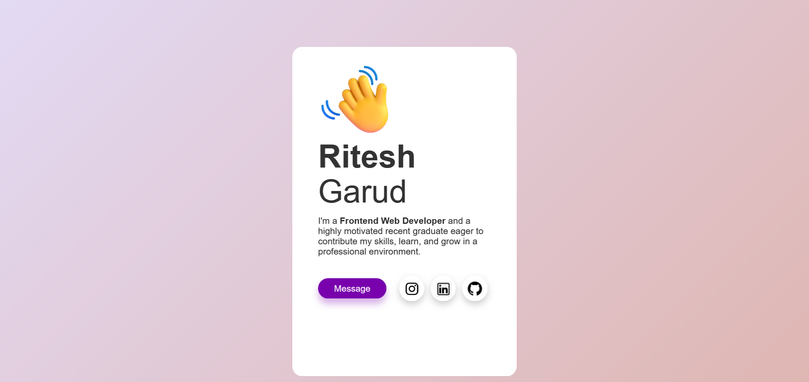

# Profile Card Project

This is a simple project for creating a "Profile Card" using HTML and CSS. The profile card displays basic information about a person, such as their name, job title, and a brief description, and it is styled with CSS to create an attractive and visually appealing card.

## Table of Contents

- [Demo](#demo)
- [Features](#features)
- [Installation](#installation)
- [Usage](#usage)
- [Contributing](#contributing)
- [License](#license)

## Demo

You can see a demo of the Profile Card here: </a>
</a>

## Features

- A stylish and visually appealing profile card.
- Sections for the person's name, job title, and description.
- Easily customizable with HTML and CSS.
- Responsive design for various screen sizes.

## Installation

1. Clone the repository to your local machine:

   git clone https://github.com/yourusername/profile-card.git

2. Navigate to the project directory:

   cd profile-card

## Usage

1. Open the 'index.html' file in your preferred web browser to view the profile card.

2. Customize the profile card by modifying the HTML content and CSS styles to match your own information or the information of the person you're creating the card for.

3. You can easily change the text and images to create a unique profile card.

## Contributing

If you'd like to contribute to this project, feel free to fork the repository and submit pull requests with your changes. We welcome any improvements or additional features.

1. Fork the repository.

2. Create a new branch for your feature or bug fix:

   git checkout -b feature/your-feature

3. Make your changes and commit them:
   
   git commit -m "Add your feature"

4. Push your changes to your fork:

   git push origin feature/your-feature

5. Create a pull request from your fork to the main repository.

## License

This project is licensed under the MIT License. You are free to use and modify the code as you see fit for your own projects.

You can use this README as a starting point for your "Profile Card" project. Remember to replace the placeholders with actual links and information specific to your project.